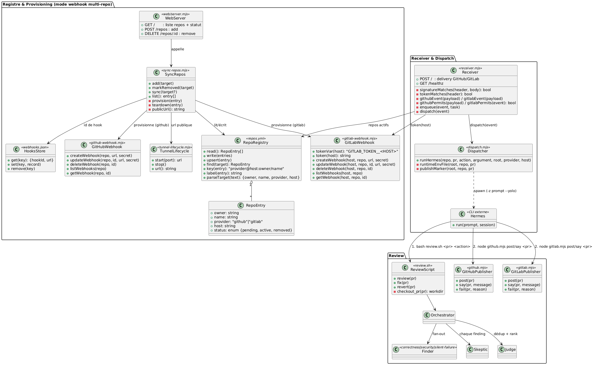
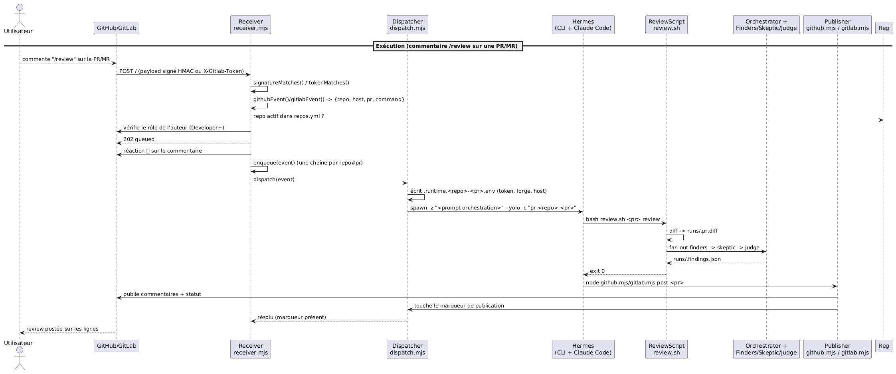
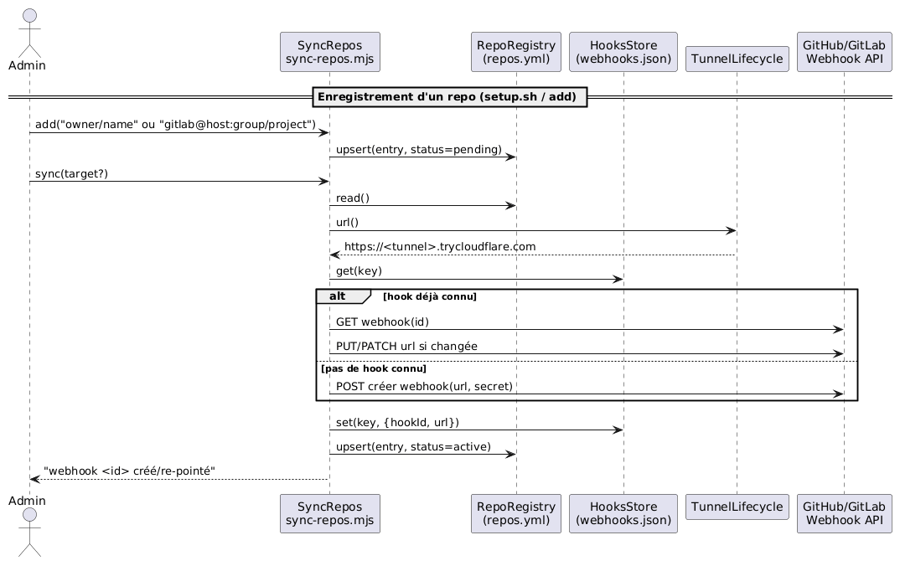

# hermes-pr-review

Revue de code par IA sur vos pull requests. Vous commentez `/review`. Ça répond sur les lignes exactes.

1. [Comment ça fonctionne](#1-comment-ça-fonctionne)
2. [Installation](#2-installation)

## 1. Comment ça fonctionne

### Les trois commandes

| Vous tapez | Ça fait |
| --- | --- |
| `/review` | lit le diff, lance vos tests, commente sur les lignes |
| `/fix` | écrit le plus petit correctif possible, le teste, le pousse |
| `/revert` | annule ce commit |

Vous avez un 👀 en moins d'une seconde, pour savoir que c'est vu.

### Architecture



Trois zones : `Registre & Provisioning` enregistre les repos et crée les webhooks,
`Receiver & Dispatch` reçoit une livraison et lance `hermes`, `Revue` fait le travail de
lecture. Source PlantUML dans [`docs/uml/scripts/`](docs/uml/scripts/) si vous voulez la
modifier (`class.puml`, `sequence.puml`).

### Deux cerveaux



- **Hermes** distribue et publie. Ne lit jamais le code.
- **Claude Code** fait le travail. Lit le diff, ouvre les fichiers, lance les tests.

Comptes séparés, pour qu'aucun des deux ne dévore le quota de l'autre. `receiver.mjs` reçoit
le commentaire, `dispatch.mjs` lance `hermes`, qui orchestre `review.sh` puis publie — même
receveur, même pipeline, que le commentaire vienne de GitHub ou de GitLab.

- **3 chercheurs** signalent tout ce qui paraît suspect
- **1 sceptique** ouvre le vrai code et essaie de démonter chaque piste. Dans le doute, il jette.
- **1 juge** dédoublonne, classe, plafonne

La sévérité se lit sur une phrase : ce qu'un utilisateur voit quand ça casse. Pas sur le bruit
que fait l'échec.

L'objectif est **1 ou 2 findings** sur une pull request normale.

### Réglages

Un seul fichier, `review.config.yml` :

| Clé | Ce que ça change |
| --- | --- |
| `model` | `claude-opus-5[1M]` lit en profondeur. `claude-sonnet-5` est 4x plus rapide. |
| `agents` | en retirer un, il arrête de chercher ce type de problème |
| `paths.blocking` | un must-fix ici fait passer le check au rouge |
| `skeptics` | mettre 3, et un finding a besoin d'une majorité pour survivre |
| `max_findings` | plafond dur |

### Ce que ça coûte

| | |
| --- | --- |
| Orchestration | quelques centimes par revue |
| Le reste | votre abonnement Claude existant |

Aucune clé API nulle part. Les deux côtés tournent sur des logins par abonnement.

## 2. Installation

### Ce qu'il faut

`node` · `gh` · `cloudflared` · `hermes` · `claude`

`setup.sh` et `setup-demo.sh` disent tous les deux ce qui manque et affichent la commande
d'installation.


`setup-demo.sh` est ponctuel : mêmes vérifications que `setup.sh` ci-dessous, mais un tunnel
éphémère, démonté au Ctrl-C. Rien n'est laissé derrière. Bon pour un premier coup d'œil, pas
pour quelque chose que vous voulez voir tourner demain.

### Sur une instance EC2, pour de vrai : `./setup.sh`

C'est le mode à lancer sur une instance EC2 vierge pour qu'elle finisse par servir tous les
repos que vous lui donnez — GitHub et GitLab, tous les deux — sans jamais rouvrir de terminal.

Dans l'ordre, il :

1. **Vérifie les binaires** (`node`, `gh`, `cloudflared`, `hermes`, `claude`) et affiche la
   commande d'installation pour celui qui manque.
2. **Complète `.env`** s'il n'existe pas déjà : demande `GITHUB_TOKEN` interactivement (jamais
   affiché, jamais journalisé), génère `WEBHOOK_MULTI_SECRET` et `WEBHOOK_MULTI_SECRET_GITLAB`,
   met `WEBHOOK_PORT` par défaut.
3. **Vérifie que `hermes` et `claude` sont connectés.** Il vous guide vers la commande de login,
   il ne la lance jamais lui-même — ça reste toujours interactif, une fois, à la main.
4. **Démarre un tunnel `cloudflared` de démarrage**, juste le temps d'enregistrer le premier
   webhook.
5. **Enregistre `REPO=owner/name`** (ou re-pointe tous les webhooks déjà dans `repos.yml` vers
   le tunnel courant, si vous en avez déjà d'enregistrés).
6. **Passe la main à `systemd --user`** : arrête le tunnel de démarrage, génère les unités dans
   `ops/`, active le lingering (pour qu'elles démarrent au boot sans personne connecté), et
   démarre `hermes-webhook.target` — la chaîne `preflight → tunnel → webhook-sync → receiver`.
   À partir de là, ça survit à un reboot sans jamais rouvrir de terminal.

Relancer `./setup.sh` est toujours sûr : chaque étape vérifie d'abord son propre état (token
déjà sauvé, tunnel déjà monté, repo déjà enregistré, unités déjà installées) et ne fait rien
plutôt que de dupliquer.



---

Les repos GitHub et les projets GitLab partagent un seul processus, un seul port, un seul
tunnel et un seul `repos.yml`. La ligne dit lequel :

```
davidaddi/demo:active                                github.com, l'orthographe par défaut
gitlab@gitlab.com:group/project:active               gitlab.com
gitlab@gitlab.digiteka.com:group/sub/project:active  une instance auto-hébergée, sous-groupes compris
```

Enregistrer un projet GitLab ne fait pas partie de `./setup.sh` — faites-le directement, une
fois que `.env` a les deux choses ci-dessous :

```bash
node src/provisioning-webhook/sync-repos.mjs add gitlab@gitlab.digiteka.com:group/sub/project
```

Deux choses de plus dans `.env`, à la main (`setup.sh` ne génère que le secret partagé, jamais
un token personnel) :

- `WEBHOOK_MULTI_SECRET_GITLAB` — déjà généré par `setup.sh`. Un secret partagé pour toutes les
  instances GitLab, volontairement pas le même que celui de GitHub : GitLab ne signe pas le
  corps, il met le secret lui-même dans un en-tête `X-Gitlab-Token` sur chaque livraison, et
  celui de GitHub n'est censé jamais quitter cette machine.
- `GITLAB_TOKEN__<HOST>` — un token d'accès personnel par instance, scope `api`, l'hôte en
  majuscules avec les points et tirets remplacés par des underscores :
  `GITLAB_TOKEN__GITLAB_COM`, `GITLAB_TOKEN__GITLAB_DIGITEKA_COM`. Deux instances, ce sont deux
  comptes, donc un seul token ne peut pas suffire.

Le hook créé s'abonne seulement aux évènements de note. Le payload de GitLab ne dit pas ce que
le commentateur a le droit de faire sur le projet, donc le receveur interroge l'API avant de
distribuer et exige Developer (niveau d'accès 30) ou plus, appartenances de groupe héritées
comprises ; tout ce qu'il ne peut pas confirmer est un non. Sur GitHub cette réponse se lit
directement dans le payload.

Une différence dans ce qui revient : sur GitLab la revue est une seule note de merge request —
le même tableau récapitulatif, puis une ligne par finding — plutôt qu'un commentaire par ligne.
Le 👀, le statut de commit `hermes-review`, `/fix` et `/revert` fonctionnent pareil sur les deux.

### Vérifier que tout marche bien

`./setup.sh` ajoute trois alias à `~/.bashrc` (idempotent — le relancer ne les duplique jamais) :

| Alias | Lance | Dit |
| --- | --- | --- |
| `lr` | `sync-repos.mjs list` | chaque repo enregistré et si son webhook est `up` ou `stale` |
| `herstat` | `systemctl --user list-units 'hermes-*' --all` | lesquelles des quatre unités systemd sont `active` |
| `vpr` | `review-status.mjs` | quels `/review`/`/fix`/`/revert` tournent en ce moment, sont en attente, ou viennent d'échouer |

```bash
lr                                              # statut du webhook par repo
herstat                                         # hermes-preflight/tunnel/webhook-sync/receiver
vpr                                             # ce qui tourne / attend / a échoué, maintenant
curl -s 127.0.0.1:$WEBHOOK_PORT/healthz         # "ok, N repositories" directement depuis le receveur
journalctl --user -u hermes-receiver -f         # regarder une livraison arriver, en direct
systemctl --user status hermes-receiver         # actif depuis quand, nombre de redémarrages
```

La colonne `webhook` de `lr` est celle à qui se fier après un reboot ou un redémarrage du
tunnel : le tunnel éphémère change de nom d'hôte à chaque démarrage, et `stale` veut dire un
repo dont le hook pointe encore vers le nom d'hôte d'hier. `hermes-webhook-sync.service`
corrige normalement ça tout seul, en quelques secondes après le redémarrage du tunnel ; s'il
reste `stale`, `herstat` montrera cette unité pas `active`, et `journalctl --user -u
hermes-webhook-sync` dira pourquoi.

```bash
node src/provisioning-webhook/sync-repos.mjs sync    # re-pointer tous les webhooks à la main
systemctl --user disable --now hermes-webhook.target # tout arrêter
```


### Limites

- Le tunnel éphémère est plafonné à 200 requêtes concurrentes. Bien pour un bac à sable, pas
  pour un très gros trafic.
- `setup-demo.sh` : terminal ouvert, le fermer arrête 
- Sur un très gros diff, une passe échantillonne plutôt que de tout couvrir.
